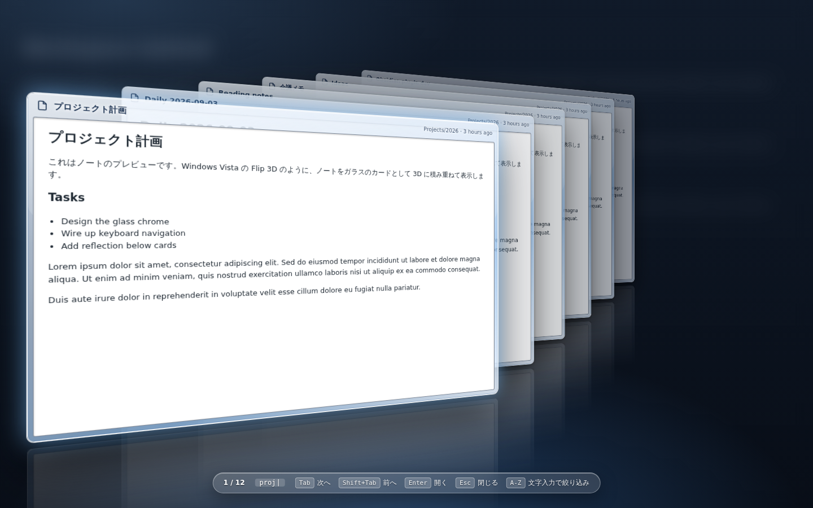
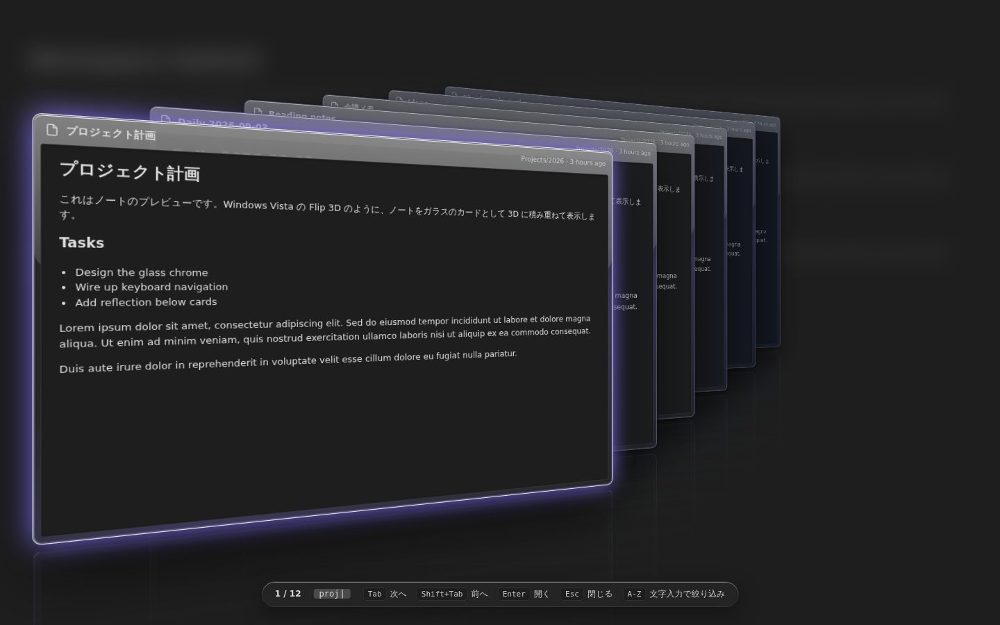

# Note Flip

Windows Vista / 7 の **Aero Flip 3D** 風の UI で、Obsidian のノートをパラパラめくるプラグインです。
ノートを半透明ガラスのカードとして 3D に積み重ね、`Tab` や矢印キー、マウスホイールでめくり、`Enter` で開きます。



> 上の画像はこのプラグインの CSS を Chromium でレンダリングしたモックです。実際の Obsidian 上では、ノートの内容がカードにプレビュー表示されます。

## 機能

- **Flip 3D スタック**: ノートをガラスのカードとして斜めに積み上げ、3D パースペクティブで表示
- **Alt+Tab 風の操作**: `Alt` / `Ctrl` / `Cmd` を含むホットキーで起動した場合、修飾キーを離した瞬間に選択中のノートを開く
- **めくり操作**: `Tab` / `Shift+Tab`、矢印キー、`PageUp` / `PageDown`、`Home` / `End`、マウスホイール、スワイプ（モバイル）
- **文字入力で絞り込み**: スタック表示中に文字を打つと、タイトルとパスであいまい検索
- **Markdown プレビュー**: 各カードにノートの冒頭を整形済み Markdown で表示（プレーンテキストにも切替可）
- **ノートの選び方**: 最近開いたノート / 開いているタブ / 保管庫内の全ノート（更新日時順）
- **2 種類の見た目**: Vista 風の青いガラス（Aero）、または現在の Obsidian テーマの配色
- **調整項目**: 傾き角度、カード間隔、見える枚数、アニメーション時間、反射のオン/オフ など
- UI は日本語 / 英語（Obsidian の言語設定に追従）



## 使い方

1. コマンドパレットから **「ノートをめくる (Flip 3D)」** を実行するか、左リボンのレイヤーアイコンをクリックします。
2. カードをめくって目的のノートを選び、`Enter` かクリックで開きます。`Esc` または背景クリックで閉じます。

| キー | 動作 |
| --- | --- |
| `Tab` / `→` / `↓` / `PageDown` / `Space` / ホイール下 | 次のノートへ |
| `Shift+Tab` / `←` / `↑` / `PageUp` / ホイール上 | 前のノートへ |
| `Home` / `End` | 先頭 / 末尾へ |
| `Enter` / 前面カードをクリック | 選択中のノートを開く |
| 奥のカードをクリック | そのカードを前面に持ってくる（ダブルクリックで直接開く） |
| 文字キー / `Backspace` | タイトルで絞り込み / 1 文字削除 |
| `Esc` / 背景クリック | 閉じる |

### Alt+Tab のように使う

「設定 → ホットキー」で **Note Flip: ノートをめくる** に修飾キー付きのホットキーを割り当てます。
例: `Ctrl+Tab`（Obsidian 標準の「次のタブ」から付け替え）や `Alt+@`。

- 修飾キーを押したままホットキーのキーを連打するとカードが進みます（`Shift` 併用で戻る）。
- 修飾キーを離すと選択中のノートが開きます。
- 既定では開いた時点で 2 枚目（直前のノート）が選ばれているので、押してすぐ離せば直前のノートに戻れます。

この挙動は設定の「修飾キーを離したら開く」「前のノートを初期選択にする」で変更できます。

### コマンド一覧

| コマンド | 内容 |
| --- | --- |
| ノートをめくる (Flip 3D) | 設定で選んだノートの集合で開く |
| 最近のノートをめくる | 最近開いたノート（足りない分は更新日時順で補完） |
| 開いているタブをめくる | ワークスペースで開いているノートのみ |
| すべてのノートをめくる | 保管庫内の全ノートを更新日時順に |

## インストール

### 手動インストール

1. [Releases](https://github.com/wineda/obsidian-note-flip/releases) から `main.js`、`manifest.json`、`styles.css` をダウンロードします。
2. 保管庫の `.obsidian/plugins/note-flip/` フォルダを作り、3 つのファイルを置きます。
3. Obsidian を再読み込みし、「設定 → コミュニティプラグイン」で **Note Flip** を有効化します。

### BRAT を使う

[BRAT](https://github.com/TfTHacker/obsidian42-brat) に `wineda/obsidian-note-flip` を追加します。

## 開発

```bash
npm install
npm run dev     # 変更を監視して main.js をビルド
npm run build   # 型チェック + 本番ビルド
```

ビルドされた `main.js` と `manifest.json`、`styles.css` を保管庫の `.obsidian/plugins/note-flip/` にコピー（またはシンボリックリンク）して動作確認してください。
タグを push すると GitHub Actions がリリースを作成し、3 ファイルを添付します。

### 構成

| ファイル | 役割 |
| --- | --- |
| `src/main.ts` | プラグイン本体。コマンド、リボン、修飾キーの押下状態の追跡 |
| `src/flipModal.ts` | Flip 3D のオーバーレイ。カードの生成・配置、キー / ホイール / タッチ操作、絞り込み |
| `src/noteSource.ts` | 表示するノートの収集（最近 / 開いているタブ / すべて） |
| `src/settings.ts` | 設定と設定タブ |
| `src/i18n.ts` | 日本語 / 英語の文字列 |
| `styles.css` | Aero ガラスの見た目、3D レイアウト、アニメーション |

### 実装メモ

- カードの位置は CSS カスタムプロパティ `--d`（前面からの深さ）だけで決まり、めくりは `--d` を書き換えて CSS トランジションに任せています。
- Chromium は 3D 変形されている要素に `backdrop-filter` を適用しないため、ガラスのフレームは半透明のグラデーションで描いています。背景のワークスペースは `.modal-bg` 側でぼかしています。
- 見える枚数より奥のカードは、最後尾の 1 つ奥に「待機」させて透明にしているので、前後どちらにめくってもカードが奥から出てくるように見えます。

## English

An Obsidian plugin that flips through your notes in a Windows Aero **Flip 3D** style stack of glass cards.
Trigger it from the command palette or the ribbon, flip with `Tab` / arrows / mouse wheel, type to filter, and press `Enter` to open.
Bind it to a hotkey with a modifier (for example `Ctrl+Tab`) and releasing the modifier opens the selected note, just like Alt+Tab.
UI strings follow Obsidian's language setting (English and Japanese are included).

## License

MIT
